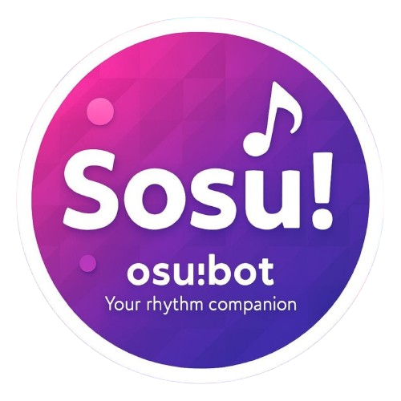
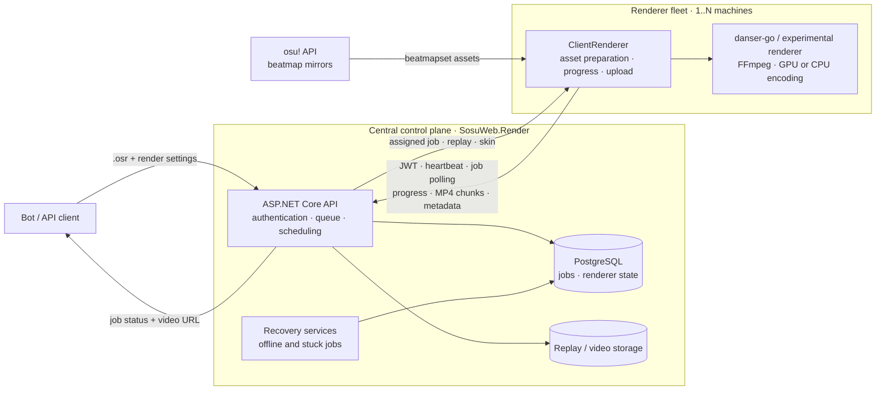

<p align="center">
  
</p>

<h1 align="center">Sosu! Client Renderer</h1>

<p align="center">
  A distributed .NET worker that turns osu! replay files into ready-to-publish videos.
</p>

<p align="center">
  <a href="https://github.com/Shoukox/ClientRenderer/releases"></a>
  
  
  
</p>

Client Renderer is the data-plane component of the Sosu! video rendering platform. It can be installed on multiple rendering machines; every instance authenticates with the central server, advertises its availability, pulls an assigned job, renders it locally, and uploads the result.

The control plane lives in the separate [`SosuWeb.Render`](https://github.com/Shoukox/SosuWeb/tree/main/SosuWeb.Render) service. Keeping scheduling on the server and expensive media work on replaceable workers makes it possible to scale rendering capacity by adding ordinary GPU-equipped computers.

## Highlights

- **Distributed pull-based workers** — renderer nodes need outbound HTTP access only, which makes machines behind NAT easy to add.
- **Priority-aware scheduling** — the server assigns queued jobs to active, idle renderers according to their benchmark-derived performance score.
- **Two rendering backends** — standard replays use [danser-go](https://github.com/Wieku/danser-go); other rulesets and opt-in jobs use the experimental renderer.
- **Resilient media pipeline** — local beatmap caching, multiple download providers, HTTP retries, cancellable child processes, and retryable chunk uploads.
- **Operational desktop app** — Avalonia GUI, tray integration, live connection/render status, localized UI, logs, startup launch, and Velopack updates.
- **Headless mode** — a CLI host is included for unattended renderer nodes.

## Architecture



Workers keep reusable assets locally, while job ownership and renderer state remain centralized. A PostgreSQL-backed distributed lock serializes assignment decisions, so multiple API instances cannot hand out the same queued job.

For a standalone, presentation-sized version, see [`docs/architecture.html`](docs/architecture.html).

## Render lifecycle

1. An authorized requester sends an `.osr` replay and render settings to `SosuWeb.Render`.
2. Each renderer obtains a role-scoped JWT through the client-credentials flow, sends heartbeats, and polls for work.
3. The server atomically assigns the oldest queued job to the highest-priority active renderer.
4. The worker downloads and decodes the replay, resolves the beatmap through its cache/provider chain, prepares the skin, and selects a rendering backend.
5. While the child renderer is running, Client Renderer reports progress and watches for server-side cancellation.
6. The finished MP4 is uploaded in 5 MiB chunks. The worker then creates a thumbnail, reports metadata, and marks the job complete.

### Failure handling

| Mechanism | Behaviour |
| --- | --- |
| Renderer heartbeat | Sent every 10 seconds; the server releases a renderer's active job after it becomes unavailable. |
| Safe assignment | A PostgreSQL distributed lock and explicit renderer/job state prevent duplicate ownership. |
| Stuck-job detection | A background service closes jobs that have not reported render activity for 10 minutes. |
| HTTP resilience | Transient requests use bounded retries with jitter; each video chunk has up to five upload attempts. |
| Cancellation | The worker checks job state every 2 seconds and terminates the local renderer process when cancelled. |
| Asset acquisition | Beatmaps are cached and validated by hash, with Syui, Sayobot, Mino, and osu! used as fallback providers. |

## Technology

| Area | Stack |
| --- | --- |
| Worker | C#, .NET 9/10, dependency injection |
| Desktop | Avalonia UI 12, MVVM, system tray, localization |
| Rendering | danser-go, osu-replay-viewer, FFmpeg/FFprobe |
| Networking | REST over HTTP, OAuth 2.0 client credentials, JWT, Polly |
| Operations | Serilog, Velopack automatic updates |
| Control plane | ASP.NET Core, Entity Framework Core, PostgreSQL distributed locks |

## Repository layout

```text
ClientRenderer/
├── ClientRenderer/                    # Worker core, server connection, render pipeline
├── ClientRenderer.GUI/                # Avalonia desktop host
├── ClientRenderer.CLI/                # Headless command-line host
├── DanserWrapper/                     # danser-go process and configuration adapter
├── ExperimentalRendererWrapper/       # Experimental renderer adapter
└── docs/                              # Architecture material
```

The worker core is UI-agnostic: both hosts compose the same downloader, connection, rendering, thumbnail, and update services through dependency injection.

## Getting started

### Prerequisites

- .NET 10 SDK to build the complete solution
- Windows x64 or Linux x64
- osu! API v2 credentials and a valid `osu_session` cookie
- renderer OAuth credentials issued by `SosuWeb.Render`
- an NVIDIA encoder (`h264_nvenc` or `av1_nvenc`) or `libx264` for CPU encoding

The GUI downloads supported danser-go and experimental-renderer binaries on first launch when they are not already present.

### Build from source

```bash
git clone https://github.com/Shoukox/ClientRenderer.git
cd ClientRenderer

dotnet restore ClientRenderer.slnx
dotnet build ClientRenderer.slnx --configuration Release
dotnet run --project ClientRenderer.GUI/ClientRenderer.GUI.csproj
```

On first launch, the worker creates the missing files in its `settings` directory and exits until they are populated:

```text
settings/
├── cookie.txt
├── osu-api.json
└── renderer-settings.json
```

Example `osu-api.json`:

```json
{
  "ClientId": 12345,
  "ClientSecret": "<osu-api-v2-secret>"
}
```

Example `renderer-settings.json`:

```json
{
  "client-id": 42,
  "client-secret": "<renderer-secret>"
}
```

`cookie.txt` contains only the value of the `osu_session` cookie. These three files contain secrets and must never be committed.

The server URL, default encoder, language, and desktop behaviour are stored in the application settings. They can be edited from the status/settings pages.

### Run the CLI host

The CLI expects rendering backends to be present alongside the application:

```bash
dotnet run --project ClientRenderer.CLI/ClientRenderer.CLI.csproj -- \
  --server https://render.example.com \
  --encoder h264_nvenc
```

Supported encoder examples are `h264_nvenc`, `av1_nvenc`, and `libx264`.

<details>
<summary><strong>Renderer API contract</strong></summary>

The worker primarily uses these control-plane endpoints:

| Method | Endpoint | Purpose |
| --- | --- | --- |
| `POST` | `/jwt` | Exchange renderer credentials for a scoped access token |
| `POST` | `/render/heartbeat` | Refresh renderer liveness |
| `POST` | `/render/get-next-render-job` | Pull the next assigned job |
| `POST` | `/render/download-replay` | Download the assigned replay |
| `POST` | `/render/report-rendering-progress` | Update progress and job activity |
| `POST` | `/render/upload-replay-videofile` | Upload an MP4 chunk |
| `POST` | `/thumbnails/upload` | Upload the generated preview |
| `POST` | `/render/finish-rendering` | Complete the job and release the worker |

</details>

## Related projects

- [`SosuWeb.Render`](https://github.com/Shoukox/SosuWeb/tree/main/SosuWeb.Render) — central API, queue, scheduler, storage, and renderer monitoring
- [danser-go](https://github.com/Wieku/danser-go) — primary osu!standard replay renderer
- [osu-replay-viewer-continued](https://github.com/Shoukox/osu-replay-viewer-continued) — experimental multi-ruleset renderer

---

osu! is a trademark of ppy Pty Ltd. This project is not affiliated with or endorsed by ppy Pty Ltd.
